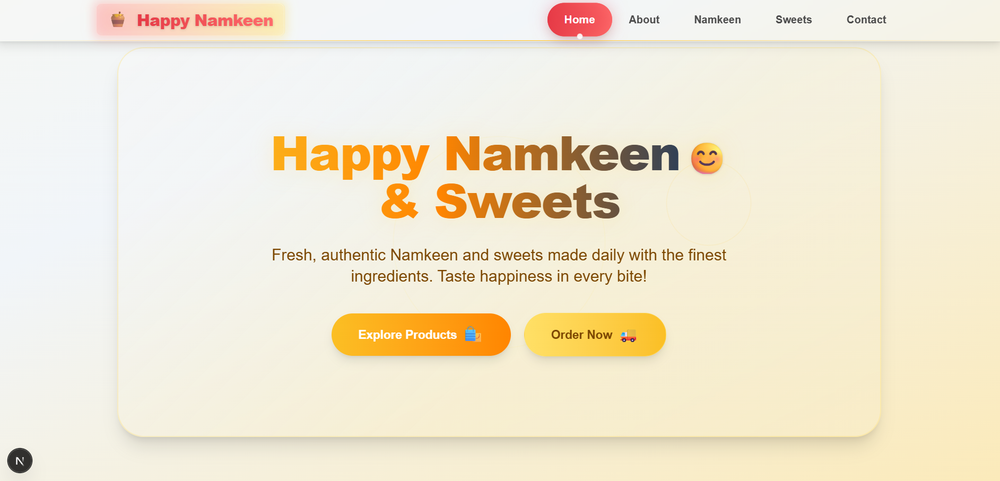

# Happy Namkeen & Sweets

A modern, vibrant Next.js website for Happy Namkeen & Sweets, featuring a beautiful hero section, product highlights, and a responsive design.

## 🚀 Live Demo

[Deployed on Netlify](#) <!-- Add your Netlify link here after deployment -->

## ✨ Screenshots

### Hero Section



<!-- Add more screenshots as needed -->

## 🛠️ Getting Started

Clone the repository:

```bash
git clone https://github.com/Harshnama123/Happy-Namkeen-Sweets.git
cd Happy-Namkeen-Sweets
```

Install dependencies:

```bash
npm install
```

Run the development server:

```bash
npm run dev
```

Open [http://localhost:3000](http://localhost:3000) to view it in your browser.

## 🏗️ Build for Production

```bash
npm run build
npm start
```

## 🌐 Deploy on Netlify

1. Push your code to GitHub.
2. Go to [Netlify](https://app.netlify.com/) and create a new site from Git.
3. Connect your repository and set the build command to `npm run build` and publish directory to `.next`.
4. Click "Deploy" and your site will be live!

## 📁 Project Structure

- `app/` - Main application code (pages, components)
- `public/` - Static assets (images, favicon, etc.)
- `styles/` - Global styles
- `package.json` - Project metadata and scripts

## 🤝 Contributing

Pull requests are welcome! For major changes, please open an issue first to discuss what you would like to change.

## 📄 License

[MIT](LICENSE)

---

> Made with ❤️ for Happy Namkeen & Sweets
